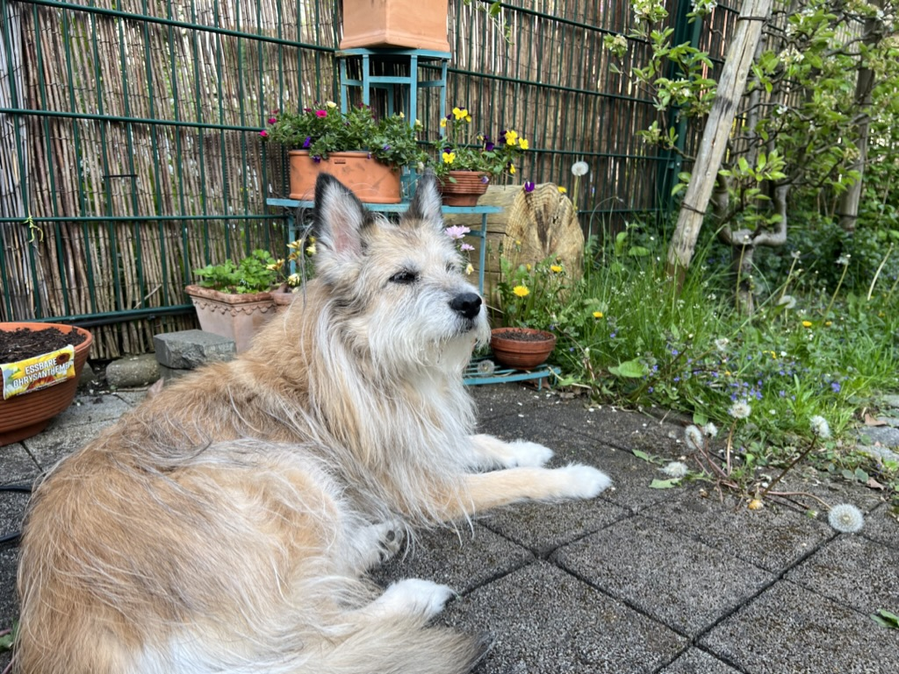

# Pills for Home Assistant

Take stock of your dogs medicinal supplies.

## Installation

## Description

The integration provides several entities to track the state and supply levels of tablets. For each tablet type, the component stores the number of tablets we have (typically printed on the box), together with the prescribed doses in the morning, at noon, in the evening and at night. Based on this information, we can predict when we run out of tablets -- this is the state of the main sensor. A second "problem sensor" can signal the need to go to the vet before we run out of tablets.

To make this really useful, the component adds a new service call `pills.take_pills`, which can be called to signal that the correct amount of tablets has been taken. This leads to an update of the supply levels of each consumed pill type.

## Back story



This is Bona, our 12 year old dog. Bona is an awesome dog, but unfortunately not very healthy. Thus, we feed her an increasing set of tablets every morning and every evening. Shortly after having started with Home Assistant, I started playing around with ways to track the inventory of Bonas tablets -- in order to timely get new tablets when the old packages get empty. 

This essentially can be done with template entities, but it's cumbersome. 

```yaml
      - unique_id: pills_vetoryl_10mg_daily
        state: >-
          {{ states('input_number.bona_pill_vetoryl10_pro_tag_morgens')|float + states('input_number.bona_pill_vetoryl10_pro_tag_mittags')|float + states('input_number.bona_pill_vetoryl10_pro_tag_abends')|float }}
      - unique_id: pills_vetoryl_10mg_vorrat
        device_class: timestamp
        state: >-
          
          {{ predict_pills_state("input_number.bona_pill_vetoryl10", "sensor.template_pills_vetoryl_10mg_daily") }}
        attributes:
          remaining_days: >-
            
            {{ predict_pills_remaining_days("input_number.bona_pill_vetoryl10", "sensor.template_pills_vetoryl_10mg_daily") }}

```

This is an excerpt of my `templates.yaml` file, making use of [custom templates, introduced in 2023.4](https://www.home-assistant.io/blog/2023/04/05/release-20234/). The first entity `pills_vetoryl_10mg_daily` calculates the total daily consumption of a specific tablet type, while the second `pills_vetoryl_10mg_vorrat` predicts when this pill type will be gone.

In addition to these two template entities (for no less than six different tablet types), this requires `input_number` entities for morning, evening and noon, because -- of course -- the dog gets a different combination of tablets every time (and this also changes from time to time).

Because this is very repetitive and makes all my files unreadable, I created this custom component (also, to find out if I could, and because it was fun).